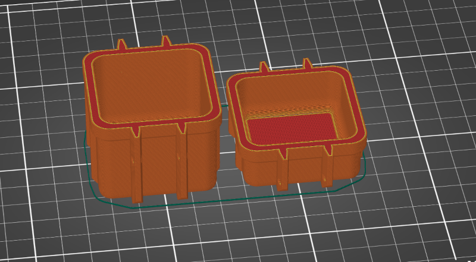
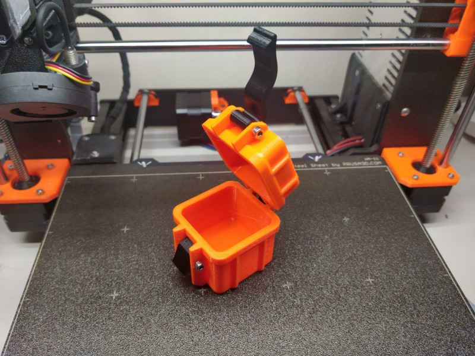

# penguin_case
3D printed, parametric, ~waterproof~ latching box

## Awesome Features

* Holds things
* Has any number of clasps or hinges as long as it's an integer between 0 and 2 noninclusive
* Compatible with hinges and clasps from: https://www.thingiverse.com/thing:4094861

## Eventual Features

* More customizable (2 hinges on left and right side of box!)
* Penguin clasp design (ones that aren't 3rd party)
* Weather/water proofing seals

## Prototype

Inspired by the excellent [Frog Box v2.0 by Nibb13](https://www.thingiverse.com/thing:4094861).
